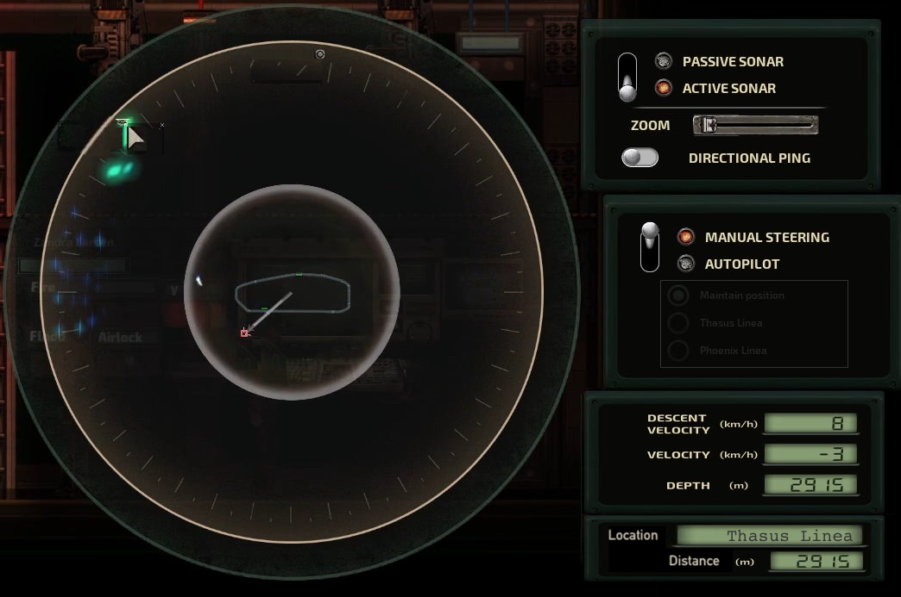
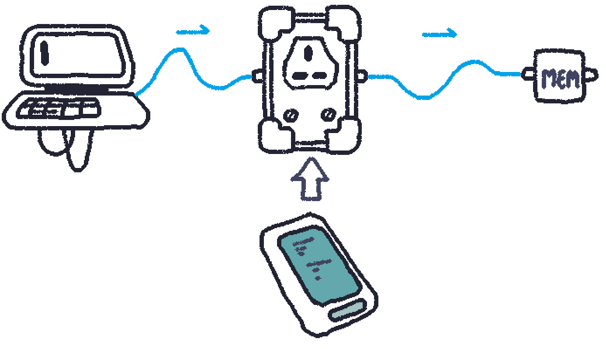
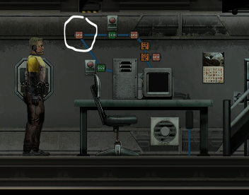
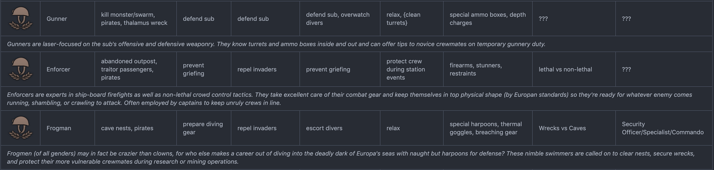
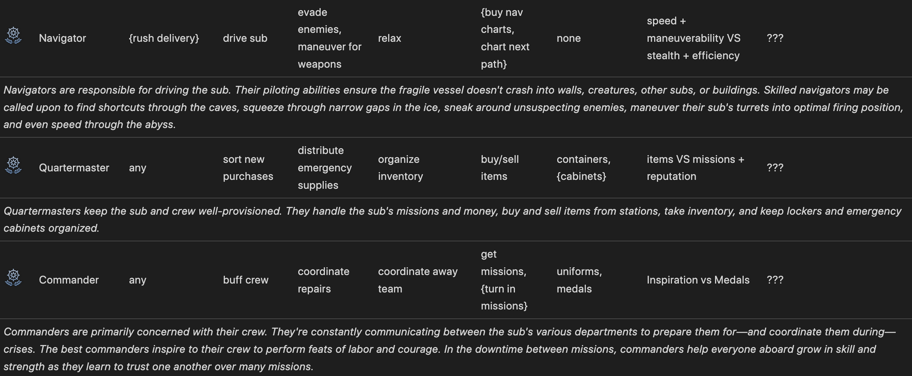
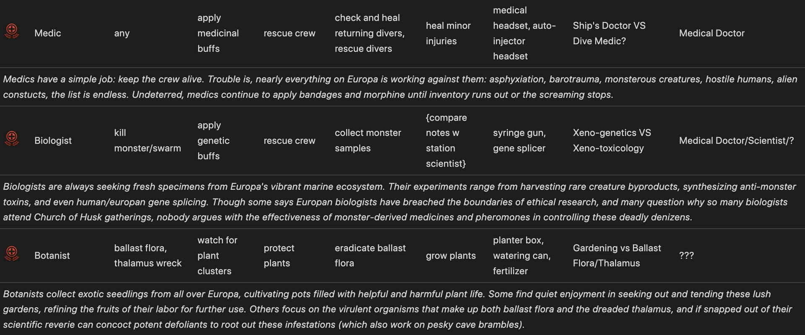
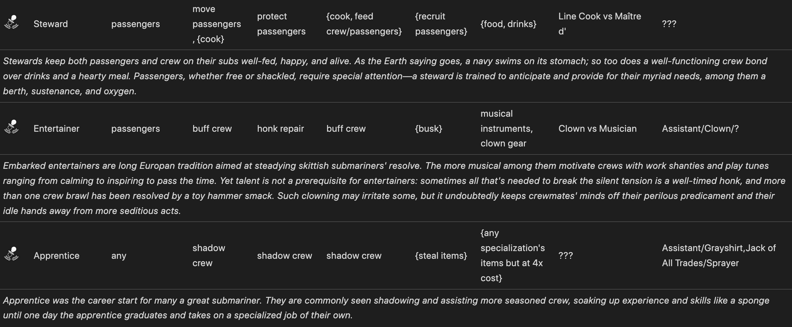

# Pragmas:
- buff (affilction) icon same as the one talent giving you the buff
- about 2 new items per specialization tree.

- The range of the effects is irrelevant tbh in everything. Making a role in its entirety based on its range is counterproductive but thinking more on a personal talent by talent basis is more effective. You have the right idea with XO but maybe think more like health, speed, and skill boosts.
- All talents should have 1 thing to give all people, an weapon, and an diving suit colored accordingly

CrazyIvan#9415
On Progression:
1. character progression: character gets better skills/talents/reputation, thereby gaining more/better stuff (e.g. crafting/buying cheaper, mining yields more).
2. player progression: player gets better (usually at game knowledge, sometimes at a mini-game) at getting resources and not wasting resources.
3. gear gets better, costing less to upkeep and giving greater rewards. sub improvements fall in this category too.

A. constant maintenance/moneysinks. <- mostly Barotrauma is here.
B. power creep/overpowered. <- talents pull it in this direction.
Player progression is not very welcoming, and things like wikis can circumvent the learning experience. And there's no way to reset it.
With character progression it's tricky to balance because usually the only way to reset power creep is killing the character forcing the player to start from scratch which tends to feel bad.
So that leaves gear/vehicle progression as the safest way to balance things. Of those, avoiding power creep means having deterioration or upkeep mechanics to function as  a player resource sink.
https://discord.com/channels/103209684680323072/220881718666723328/1000249008679305226

Make compatibiloty patches rather than blocking yourself for making features

#### Fabricator split up
Cephalopod 🇺🇦 Oracle#4892 532596743976779783: 
the "fabricator" is already split up into the generic fabricator, the medical fabricator, and the electrical fabricator which, as you say, isn't enough separation all of the weaponry stuff could be moved to a weapons table, so manufacturing bullets railguns and refilling coilgun boxes, possibly call it the field fabricator, and add all sorts of other refilling recipes something that would get a submarine basic life-extending abilities, but not exactly self-sufficiency having this fabricator alone would make simply owning amounts of items first pretty important- refilling a coilgun ammo box requires the empty coilgun box, refilling a fuel rod requires an empty fuel rod first
https://discord.com/channels/103209684680323072/220881718666723328/999909690848854036
WJohnston#2820 227061291720769537: 
i kind of wish fabricators were broken up into more types of fabricators one for tools crafting, one for weapons/ammo, one for electrical equipment etc.

# To Sort:
Little big planet like processors that can construct logic and then embed itself to a component
Wiartarka
"...or make transformers as a craftable item!"
Tear gas

# LUA things (impossible in xml)
- Adaptive limits on classes? Except co, based on amout of people in the lobby
- When you have quickdraw, creaft an item, holster that gives you gain an ability to press q and draw a waepon from your outfit
- Split more boring skills to an separwte skill tree, that you pay with "skill" points (weapons, eng etc) like passive bonuses
- add lua inegration, more skills per class engineer gets no max on engineering skill

# Overhauls:
## Engineering:
#### Overhaul idea:
Imagine an overhaul to all electrical and mechanical machines onboard a submarine. What if there was a learning curve and items to boost machines you can use. Oil, coolant, preventative maintenance etc etc. Even adding in new utility items like bildge pumps and placeable items like barocraftables. The creators of those mods have previously given consent towards making a project of such but this never came to fruition.
RobFather#0805: to take it one step further, imagine repairs requiring more tools that influence repairs... ie insulated gloves and screwdrivers that eliminate electrocution risk but increase repair time, multimeters that speed up repair time but are destroyed if you are electrocuted and require batteries, multiple specific wrench sizes required for different pumps, and of course, duct tape which speeds up repair time but increases deterioration rate
#### Navigation terminal additional displays
CrazyIvan#9415
Could declutter it by having location-specific info show up somewhere [bottom right] when mousing over an icon [top left]. (I'd prefer these things be signals (e.g. into TextDisplays linked to the SonarMonitor) so engineers and sub builders have more control, but the sonar/nav interface is pretty far from that dream…)

https://discord.com/channels/103209684680323072/220881718666723328/1003002383162429521
#### Logbook component, personal storage of data
Solbusaur#4343 220208697429852160: 
Add a component that allows a logbook to behave as a memory component (without the lock state pin), a compartment that only accepts a logbook and reads from/writes to it. This will allow logbooks to act sort of like disks that can be inserted and ejected from logic circuits. Its an alternative I'd like from unwrenching memory components, or placing them and hooking up the wires all over again.
An extra property is included specific to the output pin which is the same as the concatenation component's "separator". Each entry in the logbook is split by a chosen value, which can be set by the player to "\n" or "\n> " if they want it to feed back into a terminal

Here's what I made with already existing components, the circled :ComponentMemory: would be replaced by the logbook plugin

https://discord.com/channels/103209684680323072/220881718666723328/1000155091136954428
#### Fabricator crituque and pondering
WJohnston#2820 227061291720769537: 
As is, just having A Fabricator is all it takes to make your ship borderline self sufficient. i think it's far more interesting when you don't have every tool under the sun.
when you can't just do whatever you like aboard your ship and have no need or incentive to interact with civilization at all.
scarcity and self-sufficiency are two aspects of the game i wish were given a major pass.
things like fuel, oxygen, and most equipment are really easy to mass produce from just going mining once in a while.
although it currently feels kind of lopsided. some minerals are far more common than others, stuff like lead and magnesium are ever-present bottlenecks you really can't get large amounts of without stations or without minmaxing your use of the Miner mechanic skill.
https://discord.com/channels/103209684680323072/220881718666723328/999889939338633246
#### Engine rework/new engine mechanics
CrazyIvan#9415 337307802794065932: 
What if what if and hear me out The engine doesn't use power but instead its max speed is based on the reactor's current temperature. That'd give you an incentive to redline the reactor when you want to go fast.
panman#3600 303179658029957121: Rather keep engine it is, but you can let it go in overdrive mode Where you feed more power But It starts killing engine
https://discord.com/channels/103209684680323072/220881718666723328/999818977746362378

## Major Item overhauls:
#### Diving suits idea
CrazyIvan#9415 337307802794065932: 
I like this idea: generic dive suit underneath more situation-specific power armor. That way players who run out of power (immobilized) can discard the suit and return to the sub. Hard choices are good.
This kind of already makes sense—if the dive suit went in the Inner Clothing slot rather than Outerwear slot, you could wear body armor or moloch shell or bandolier or a bunch of other things in your Outerwear slot over the suit.
+ Ideas for power suits:
- Combat suit: body armor can fire two two-handed weapons.
- Power Lifter: lets you carry 3 crate/ammo box/depth charges, 1 per hand and 1 on the suit's back.
- Science Suit: integrated sonar, mineral scanner, and thermal goggles. Immune to electrical effects. Maybe stealthy.
- Hazmat suit (i.e. PUCS): immune to Nuclear/Biological/Chemical effects.
- Fire suit: immune to fire. I think EK has this. Not sure what else it should do—integrated flamer or merge with Hazmat?
Obviously these are endgame-level items you work toward over multiple missions because they make you really good.
Also dumping your clothes in the dive locker to put on a dive suit feels right even if they're technically hard drysuits not wetsuits. And it means normal clothes could have bonuses and we wouldn't have to worry how those interact while diving.
CrazyIvan#9415 337307802794065932: With baro-modding it's easy to mod a diving suit so it can carry crates/ammo boxes/etc on its back; the downside is modding doesn't support showing the contained item for wearables the way it does for holdables like the welder's fuel tank or smg's magazine. So you can't tell that the suit is carrying a ton of stuff, which kind of breaks immersion for me.
What looks good is having an item in your character's hand that can hold the crates; then you can actually see them. Obviously that's overpowered on its own, so there'd need to be some way to prevent someone from using those hand controllers without also wearing the suit. I think the clown gear's approach to giving the character the clown tag could work: wearing the suit gives you the "exoskeleton" tag, and the hand controllers don't let you use them unless you have that tag. Something like that.
Pretty sure EK has some hand cart you can "push" around. That works, but makes me feel more like a porter than a badass in an exoskeleton.

I just created a GitHub Discussion to enable this kind of modding: https://github.com/Regalis11/Barotrauma/discussions/9621
https://discord.com/channels/103209684680323072/220881718666723328/1000059522804629554
more advanced diving suits would require specialized underclothing, upgraded from base clothing, if you dont have it you take damage with each step, and you move slower

# Trees (sorted shit 1)
- one  two  one - left and right should be for pda, middle one should have some kind of choice, buff yourself, or be more better for your team
- two  one  two - Unlock an small recipie and then offensive or defensive choices on left and right, buffing team and yourself very slightly)
- two  two  two - unlock a tool, or something you can give, middle is xp gain
- one  one  one - left and right respectivly weapons and diving suits. Two should be buff yourself, or buff team sort of
- 1st column -

- buffs to dmg scaled to your skill, except are engineers and mechanics, and COB
- 2nd column -

- buffs to your team and xp. Capitan like roles should have medals tree instead. Exception is CO
- 3rd column -

4th talent of a tree gives specialization token, that gives you 1 of 5 talents in line to vanilla skills. then on second one you can get 2nd tier of skill you picked or 1st tier.
Try adding 5th hidden talent row that would unlock all talents in this tree, locked behind a "mission" aka an hidden achivment aka kill 100 crawlers
Specialiations for specific jobs: allows unlockong of entire tree, but locks other specialiations.
Joint effort on getting blueprints, either for money or for materials + skill (hacking)
upgrades to health, and defence scaled to your skill. Exceptions are "Working" classes, engineers and mechanics.
new gimmick of "ruling" classes will be aoe buffs (mabe without HoS, cuz idk if i can make it specify targets).

Mech gets robots
Eng + Mech gets Exoskeleton
Make every class have their version of nuclear pda - That should make people roles more enagaging as they dont need to be in one place (cuz being in one place is not fun, and games are about fun).
Make every class type (capitan-like, engi role) have their own diving suit and weapons, both mele and ranged (engineers should have only big ass crowbar dmg, freeman like).
The Exeption is "Commanding Classes", Witch should have its own versions of them, a little more powerfull, but MUCH more expenisve, but only wealded by them. Diving suits should be normal.

CrazyIvan#9415
Collapsable Crate for looting wrecks:
Can fit in your inventory when empty/collapsed. When expanded can carry a bunch of items but can't be contained in your inventory (or cabinets). Maybe it's single-use, expand only. Or maybe it's like a "folded duffle bag" that deteriorates over a few minutes once it's deployed.
https://discord.com/channels/103209684680323072/220881718666723328/1003829090836557846

## Non vanilla (chocolate)

### Executive Officer XO:
- same as CO but smaller
- check if cap is alive, rather than to check if he is nea, when kill something gain helm, when steering gain weapons
### Yaoman
- more money
### Navigator NAV:
- burnedman - 95% burn resistance and eny immunity for flares, 100% bonus to fire damage - to all other damage type. gain the .45 colt pistol
- Flare Cannon; Handcannon flare edition and alien flares ammunition
- small, but combat and gun fire rate oriented
- Flare instead of offenive tree.
- super flares
- Super alien flare - massive light range. a long time.
- flaregun good - They melt hull.
- Stick flares to harpoons, Flares deal DOT and illuminate target (Maybe later damage exposure?) (Doesn’t attract enemies)

1st
- Shuttle Captain, Helmsman
- Driving the sub 
- Remote Navigation Controller; remotely controls navigation terminal OR Shuttle Navigation Controller, nav terminal and version just for shuttle.
- Sonar tech: increases sonar range
2nd
- AOE buff when you use shuttle nav terminal - lvl 2 skill
- small range aoe buffs
3rd
- Gills: use 50% less oxygen
- Auto beacon: a beacon that detects stun or unconsciousness.
4th
- UV Polarisng gogles. - more vison range. - a component of modular headset - tier 4 of utility tree
- Spec-ops propulsion ; Polarized Lens
- Tactical offenive tool. CC

- Dive Coordinator;
- Buffs to surability to you and other people small eoe, but smaller than diver
- Slipsuits; +25% movement speed while in slipsuit OR physical conditioning melee attack replaced with slow regen (Half of just a scratch when in water)
- Trustbuilding; while in a shuttle gain passive buff? OR
### Head of security HOS:
### Diver DIV:
- Balista gun  - better hapoon gun. - 4st offenive tier, class weapon. added velocity
- pack a punch
- creating achab spears titanium alimunum.  DU spear?. Piercing spear.
- Better plasma cutter - pulse laser bore - laser cutter.
- Rebreather, as a backapack. A tank.
- harpoons for situaltians
- harpoons that are easyer tp
- Salvor
- Tier 1; 2 glowsticks every mission
- Miner
- Tier 1; Long Haul; 60% low oxygen resistance
- Tier 2;Plant Detection; when within 50m of plants, get a status effect. 50% chance of double output from plants OR Miner
- Tier 3; If holding a storage container, gain a speed boost OR
- Frogman
- Tier 1; First Aid Training
- Craftable Ahab Spears (Psychorium spear + Titanium) (Tier 2) OR Demolitions Expert (Explosive Spears Quality)
- Deep Sea Slayer vs Bucaneer
- Ballista (1 Harpoon, ridiculous velocity)
### Chief of the Boat COB:
- small aoe buffs repair oriented
- should have many technical staff only and physical vessel buffs. Imagine a tinker skill but it lasts several minutes afterwards.
- Fusion reactor yes
- Alien items YES
- fabrcator specifocly for electric components, + 1 when you fabricate one max 5 times when you complete a mission, better tools (electric screwdriver wrench, multitool), final tiers upgrade suits
### Quatermaster QUA:
- In crysis should function excaly as mechanic but without repair bonuses
- he should have all of production perks from vanilla
- 1st tree -
- Ammo restock and crafting
- 2nd tree -
- tinkerer and hull sealer
- 3rd tree -
- Resuplyer? making misc stuff like oxygen and etc
- Tree that allows you to create reciepies for class items for a price
- Qua 3 levels of fabricator. + 1 when you fabricate something 80% chance, 50% chancd of getting dobble output when fabricating materials
### Custodian CUS:
- Painting dicks over the sub, yes
- Buildable roomba for cleaning items.
- Mason:
- Maybe janitor could drag bodies faster, have a buffed sprayer tool, come with AOE crew boosts that he applies to rooms
- Everyone should love the janitor
- whenever Janitor uses sprayer, he gets a 10% fixing speed for about 6 seconds
- Janitor could apply a buff with his sprayer to all electrical and mechanical items making them not decay for a set time
- THE CLEANER COULD SPRAY TOXINS
- I remember in space station 13 janitor could make you trip, making him very hard enemy to fight
- OH! he can create better suits. Like upgrade vanilla clothes
- Lasting Effect (Paramedics) - Medical items last 5% longer when used on others. Not on self
- Farmer
### Passenger Pas:
- BaroPlus integration (alien things)
### Prisoner Pri:
- Random Weapon evey round
- gets every small monster tamable

### Chief Medical Officer CMO:
- small aoe buffs to injecting (?)

## Vanilla (but with sprinkles)
### Commanding Officer CO (CAP):
- small buffs, but spanning entire sub
- CO wide area skills weak, but when giving orders you can give more powerfull ones.
- 1st tree buffs killing monsters, monster, abandonned outpost and pirate mission rewards, submarine offensive capabilities making your campain focused on "killing every monster you see".
- 2nd tree material gathering and prices buffs, salvage missions, cargo missions, mining missions, escort missions and beacon missions
- 3rd tree  rewards for discovering new locations, ruin scan and clear missions,
+ Themed medals
	- If a player dies gives you valor medal
- Movemnt speed buff when holding a sabre (name the talent something french)
### Mechanic Mec:
- Mec 30% chance of getting +1 when ypu fabricate something, drones that defend you
### Engineer Eng:
- More depleted uranium munitions
### Medic Med:
- https://steamcommunity.com/sharedfiles/filedetails/?id=2695068144&searchtext=talent Maybe this as a talent gun
- Med gets a special suit based on halo Miolnir undersuit, made from fulgurium, and an egg. Speeds you up, has autoinjector, and a lot of resistances, including husk resistance(Symbiote suit)

# Lose Ideas (shit 2)

#### Husk based talent tree
Emp#7209
Husk-based talent tree for assistant.
Tier 1 - Symbiotism: Husk infection does not fully complete. Calyxanide will harm the player.
Tier 2 - Egg Focus: The player periodically produces eggs which can be sold at a high price at the station, or for other purposes. - OR - Combat Focus: The player is slightly faster under water and more resistant to damage and poisons.
Tier 3 - Deathrattle: Whenever you die, your body will always come back as a husk and hunt down whoever / whatever killed you. If it succeeds, gain back control of your body. - OR - Huskmones: Other husks will not attack the player. In a near-death state, husk applies a small healing bonus in a last-ditch effort to preserve the body.
Tier 4 - Tongue Talent: You can speak again while infected with husk. Bites can be configured to cause nausea, act as a healing agent for other players, or to be infectious or not. This means you could still  be infecting someone while healing them, or giving the crew love bites to make them throw up.
https://discord.com/channels/103209684680323072/220881718666723328/1000573551444770906

#### Confetti gun ammo
Cephalopod 🇺🇦 Oracle#4892 532596743976779783: 
desire confetti ammo which makes a nice noise instead of a gun sound when you fire with it so like, revolver loaded with clown bullets, makes a nice party blower noise when it fires, or maybe a party popper noise
[mgk-machine-gun-kelly.mp4](.resource/124896ac6c034f378bd7aae03b365074.mp4)
https://discord.com/channels/103209684680323072/220881718666723328/1000191607527702559

#### Good talent ideas
]Victor2-2: 
Talents should be nerfed in raw power and instead to get even near the bonus we have now you should buy the same talent (or a better version from the talent tree) Like 4 times
[6:48 PM]Crazy Ivan: I'd prefer if the talent trees were focused on a specific aspect of a class's gameplay. Security, for example, specializes in turrets OR non-lethal crowd control OR diving vs monsters. Sure you can get all of them eventually but you'd start with the one you like the most.

[7:07 PM]WJohnston: those are certainly nice, yeah, but a lot of options are way too strong even then
[7:07 PM]WJohnston: i do like it when the choices are towards a specific playstyle that are thematically appropriate to that class
[7:07 PM]WJohnston: like expert commando makes you extremely strong in direct combat, both in ranged damage and just insane bleeding heal
[7:08 PM]WJohnston: while tandem fire lets you shred monsters faster than ever, 25% more damage on a railgun is nothing to scoff at.
[7:08 PM]WJohnston: armor piercing in particular especially benefits from raw increased damage.
[7:09 PM]WJohnston: makes chainguns with shredder rounds and pulse lasers with their massive base damage ridiculously powerful.
[7:09 PM]Crazy Ivan: That's true. I guessed they made the talents and then tried to shove them into trees. If instead we start with trees, it'll be easier to keep things balanced.
[7:10 PM]WJohnston: they're both great options, aimed at different playstyles, and are thematically appropriate to the job
[7:10 PM]WJohnston: but they're also both way too strong.
[7:11 PM]WJohnston: tandem fire being increased fire rate instead of damage would perhaps be better
[7:11 PM]WJohnston: since it would help all guns instead of just the most powerful ones
[7:12 PM]Crazy Ivan: Here are the other talent tree themes I wrote up. Should probably dump them into GitHub Discussions…

#### Capitan talent engine idea
[7:12 PM]WJohnston: i would kill to get a captain talent that actually changes the acceleration of the engine
[7:12 PM]WJohnston: not the top speed, but just how fast i can accelerate and decelerate.
[7:12 PM]WJohnston: that would be SO nice.
[7:13 PM]WJohnston: 'cause right now your acceleration is kind of flat, and is directly tied with your top speed.
[7:13 PM]WJohnston: if you can go 50km/h you can also accelerate to 20km/h really fuckin' fast.
[7:14 PM]WJohnston: this is kind of a shame because ballasts do functionally already have this mechanic
[7:14 PM]WJohnston: flow rate versus the size of the ballast tank.
[7:14 PM]WJohnston: your sub might have huge, gigantic ballasts, but very slow pumps, meaning it could potentially go super fast vertically but it takes a long time to get up to speed.
[7:14 PM]WJohnston: we don't really have this for engines/horizontal speed, sadly.
https://discord.com/channels/103209684680323072/668819422919524352/1000450255449509958

#### Uber pendragon talent ideas
https://github.com/Regalis11/Barotrauma/discussions/9625#discussioncomment-3217749